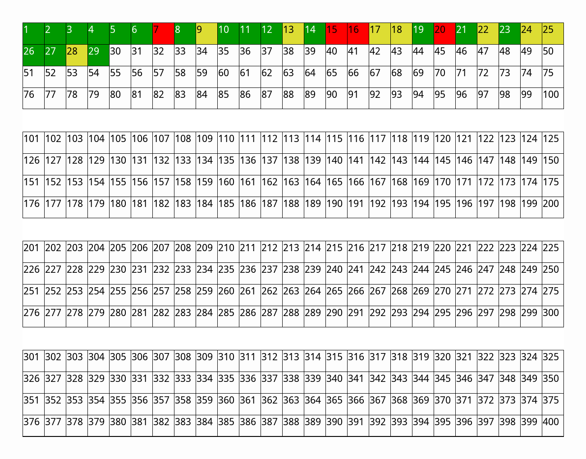

These are my solutions for [Project Euler](https://projecteuler.net/) problems. I do not agree to follow
Project Euler&rsquo;s policy regarding not publishing solutions, I encourage other
people to publish their solutions online too. For leetcode solutions see [/ps](https://git.sr.ht/~lr0/ps)

*(The following progress bar is generated automatically using [this](.github/p.py) dummy python script and updated with every new commit using even more dummy git-hook. Skipped/missing problems are highlighted with yellow. Failed problems are marked with red. Non-solved problems are not highlighted. It only contains the first 400 problems for now, hopefully one day I will need to scratch this.)*

You may find this an interesting reading: [A Prelude Over Mathematics](https://larrasket.github.io/posts/prelude.html).

